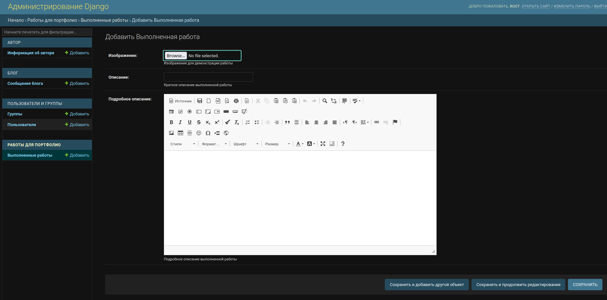
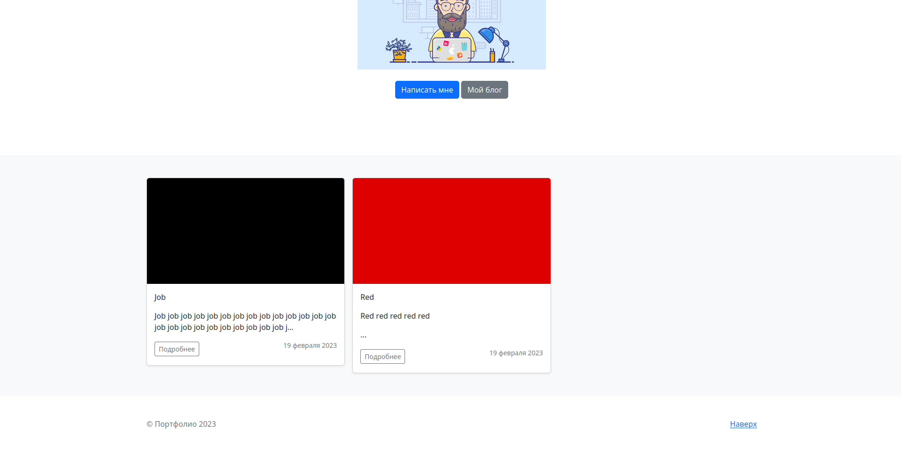
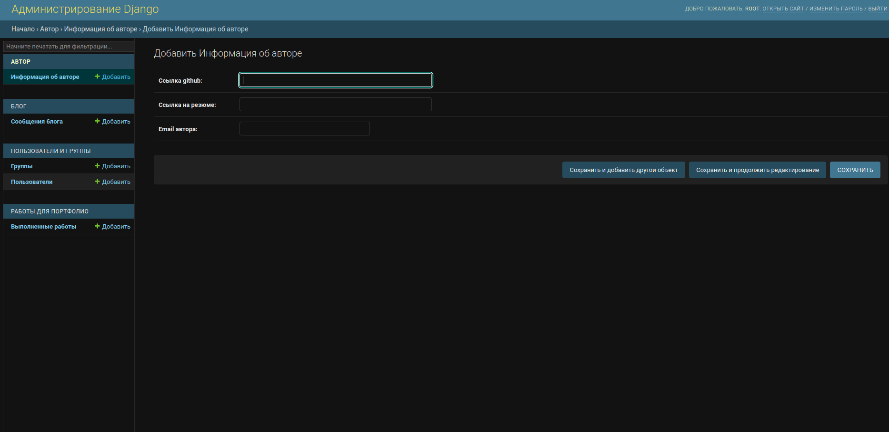
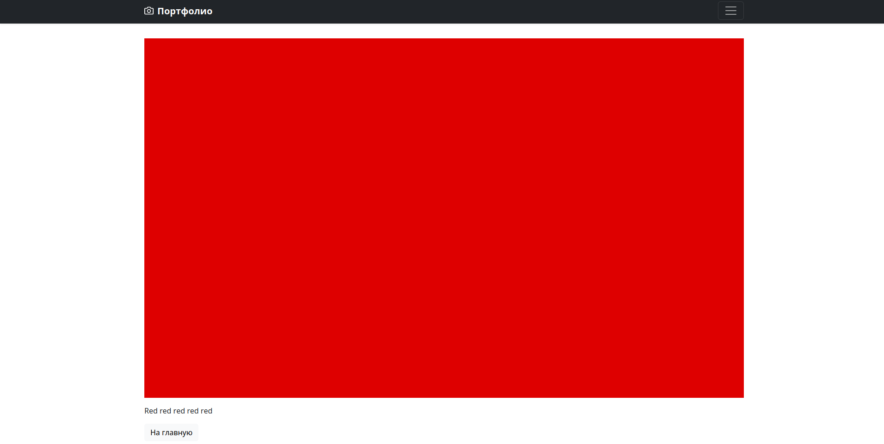
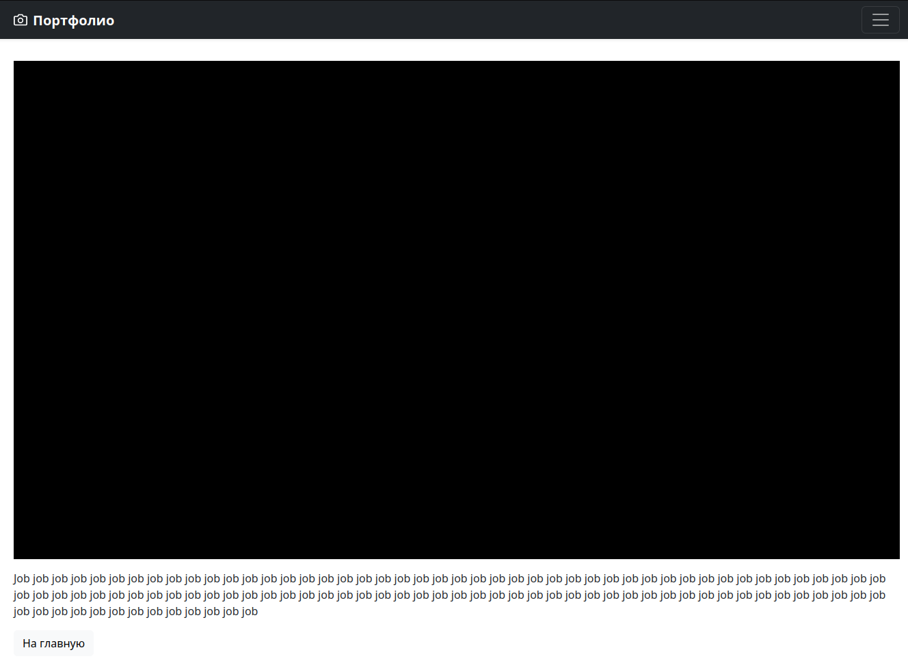
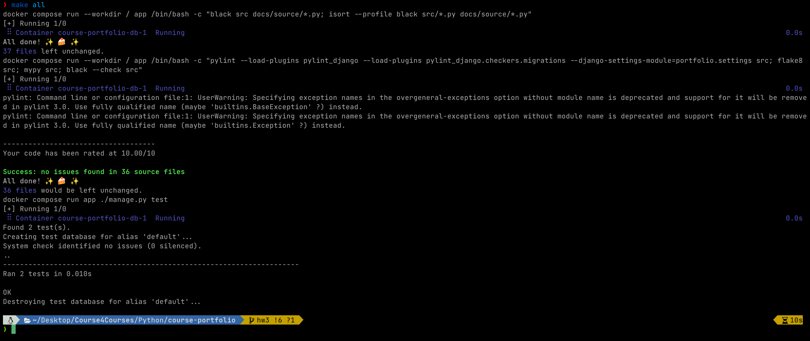

# Table of Contents

1.  [Что было сделано](#org7c6a39e)
    1.  [Модель описание работы](#org2a8434e)
    2.  [Шаблон работ](#org248449d)
    3.  [Модель автора](#orgff8b499)
    4.  [Отдельная работа](#org822701c)
    5.  [make all](#org5356a04)

# Что было сделано

Тесты для работы

## Модель описание работы

## Шаблон работ

## Модель автора

## Отдельная работа

## make all

